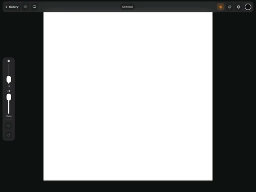

# Wiggly

An open-source animated drawing app for iPad, built for Apple Pencil with customizable, seamless-loop brushes.

> Wiggly targets iPadOS 26 and is under active development.

## Demo

## Features

- Apple Pencil pressure, tilt, azimuth, palm rejection, and coalesced input
- Customizable deterministic animated brushes
- Brush Studio with a live drawing pad
- Layers, selection, partial-stroke erasing, undo, and redo
- Smooth pan, zoom, rotation, and quick pinch-to-fit
- Image import and transform controls
- Persistent gallery with autosave and thumbnails
- Transparent PNG, GIF, MP4, and zipped PNG-sequence export
- Save exports to Photos, Files, or the iOS share sheet

## Requirements

- Xcode 26 or newer
- iPadOS 26 or newer
- Apple Pencil recommended
- Apple development team for device signing

## Run the Project

1. Clone the repository and open `Wiggly.xcodeproj`.
2. Allow Xcode to resolve ZIPFoundation.
3. Select the **Wiggly** target under **Signing & Capabilities**.
4. Choose your development team and change `co.rizzio.wiggly` if needed.
5. Connect an iPad and press `⌘R`.

## Using Wiggly

1. Create a canvas from the Gallery.
2. Open Brush Studio, choose a brush, and adjust its settings.
3. Draw with Apple Pencil; use two fingers to navigate the canvas.
4. Use Layers to organize artwork or import images.
5. Open **Actions → Export Animation** to render and share your work.

Projects autosave inside the app sandbox. Wiggly only shares files when you choose an export destination.

## Creating Brushes

Brushes are deterministic: the same document, seed, and animation phase produce the same pixels in live playback and exports.

See [BRUSHES.md](Wiggly/BRUSHES.md) for instructions on customizing brushes and adding new `AnimatedBrushKernel` engines.

## Contributing

Bug reports, performance improvements, and new loop-safe brush engines are welcome. Please test Pencil input and rendering changes on a physical iPad before opening a pull request.

## License

Licensed under the [GNU Affero General Public License v3.0 or later](LICENSE).

Wiggly includes the Gifski encoder for high-quality animated GIF export. See
[THIRD_PARTY_NOTICES.md](THIRD_PARTY_NOTICES.md) for its source and license.

## Donate

- **SOL:** `BLcuGzFvroPp56S9rHgHXyhCexCZYFKxgDzYJxxjCriz`
- **ETH:** `0x50D922255318e03f803ae1dD85755e17df2aFEC8`
